# I - Introduction

L'architecture de l'Internet moderne repose sur un ensemble de protocoles standardisés, dont le rôle principal est de permettre l'interconnexion de réseaux hétérogènes à grande échelle. Parmi ces protocoles, IPv4 et IPv6 occupent une place centrale dans le fonctionnement de l'Internet, puisqu'ils définissent la manière dont les machines s'identifient et échangent des données à travers le réseau mondial.

Ce rapport analyse les mécanismes internes des protocoles IPv4 et IPv6, de la structure des paquets et des differentes techniques de fragmentation.

# II - Description du protocole IPv4

## 1) Motivation

### a - Le préexistant (1960 - 1980)

- Les réseaux étaient principalement **petits** et **isolés**:
    - Les ordinateurs utilisaient souvent des noms d'hôtes ou des identifiants propres à chaque machine.
    - La communication se faisait surtout via des liens point-à-point dédiés ou des réseaux à commutation de paquets très réduits.
- Il n'existait pas encore de **pile réseaux** entièrement standardisée.

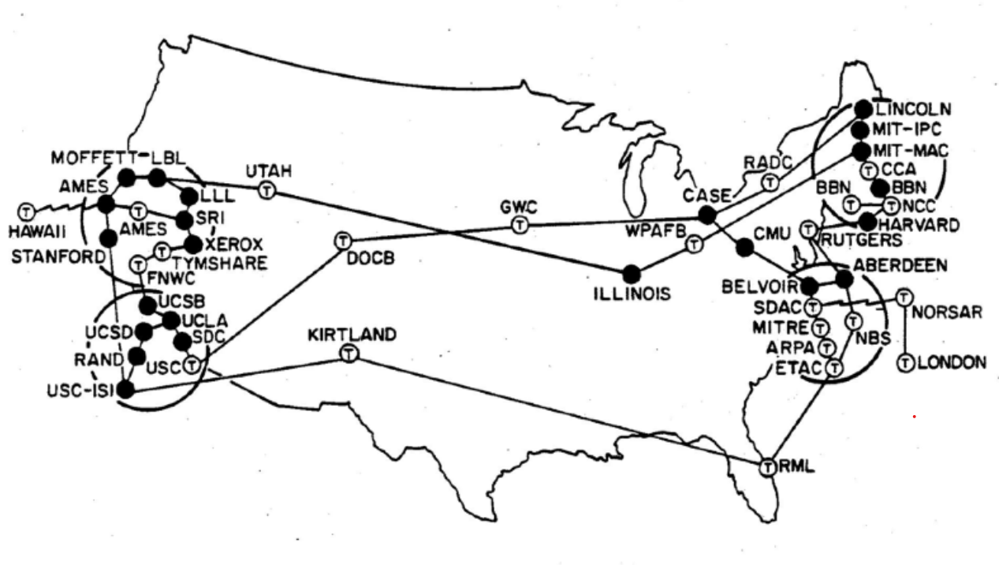

Figure 1 - ARPANET dans les années 1970

### b - Limitations des réseaux à l'époque

- **Limites de scalabilité :**
    - Ne possédait pas des fonctions comme l'adressage hiérarchique ou le routage flexible.
    - Ne pouvaient supporter efficacement que quelques dizaines à quelques centaines de machines.
- **Normalisation de la communication :**
    - Les machines avaient des architectures différentes.
    - Chacune avait sa propre manière d'envoyer et d'interpréter les données.

### c - L'émergence de IPv4

- **Routage inter-réseaux :**
    - IPv4 a introduit des réseaux logiques par-dessus les réseaux physiques.
    - Les réseaux existants sont restés inchangés. Des machines spécialisées, les passerelles (plus tard appelées routeurs), connectaient les réseaux. Elles convertissaient entre les protocoles locaux et les paquets IPv4.
- **Adressage standardisé :**
    - Chaque hôte recevait une adresse IP de 32 bits.
    - La structure hiérarchique (ID réseau + ID hôte) permettait le routage sur de multiples réseaux.
- **Format de paquet :**
    - IPv4 définissait une entête universel et des règles de fragmentation, de routage et de livraison.
    - Les routeurs pouvaient lire un paquet IPv4 indépendamment du réseau physique sous-jacent.
- **La pile TCP/IP :**
    - Standardisation d'IPv4 (1981):
        - RFC 791 définissait IPv4.
        - RFC 793 définissait TCP.
    - Ensemble, ils formaient la pile TCP/IP: IP comme couche réseau, TCP comme couche transport.

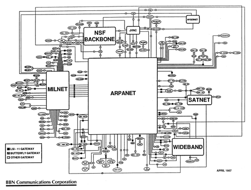

Figure 2 - Carte d'Internet en 1987

## 2) Implémentation

### a - Le module internet

- IPv4 est appelé par les protocoles hôte-à-hôte dans un environnement Internet et il appelle les protocoles de réseau local pour transporter le datagramme Internet vers la passerelle suivante ou l'hôte de destination.

- **Une interface fictive d'un module internet proposée par RFC 791:**

```c
void SEND(src, dst, prot, TOS, TTL, BufPTR, len, Id, DF, opt => result)
```

- Si les arguments sont valides et que le datagramme est accepté par le réseau local, l'appel se termine avec succès.
- En cas d'échec, un rapport raisonnable doit être fourni concernant la cause du problème, mais les détails de ces rapports dépendent des implémentations individuelles.

```c
void RECV(BufPTR, prot, => result, src, dst, TOS, len, opt)
```

- Lorsqu'un datagramme arrive dans le module du protocole Internet depuis le réseau local, soit un appel RECV correspondant de l'utilisateur concerné est en attente, soit il n'y en a pas:
    - Dans le premier cas, l'appel en attente est satisfait en transmettant les informations du datagramme à l'utilisateur.
    - Dans le second cas, l'utilisateur concerné est notifié de la présence d'un datagramme en attente.
- Si l'utilisateur concerné n'existe pas, un message d'erreur **ICMP** est renvoyé à l'expéditeur et les données sont abandonnées.

### b - Flux de paquets IPv4

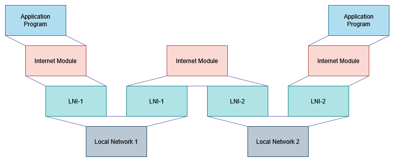

Figure 3 - Flux de paquets IPv4

- **Programme applicatif (source)**    
    - Prépare les données à transmettre.
    - Appelle son module Internet local pour envoyer un datagramme.
- **Module Internet (source)**
    - Construit l'en-tête du datagramme et y attache les données.
    - Détermine l'adresse de réseau local correspondant à l'adresse Internet (ici, celle d'une passerelle).
    - Transmet le datagramme et l'adresse locale à l'interface réseau.
- **Interface réseau locale (source)**
    - Crée une trame en ajoutant une en-tête de réseau local.
    - Envoie la trame sur le réseau local.

- **Réception par la passerelle**
    - La trame arrive encapsulant le datagramme.
    - L'interface réseau de la passerelle retire l'en-tête local et remet le datagramme à son module Internet.
- **Module Internet (passerelle)**
    - Analyse l'adresse Internet du datagramme.
    - Détermine qu'il doit être relayé vers un autre réseau.
    - Calcule l'adresse locale de l'hôte de destination.
    - Transmet le datagramme à l'interface réseau adaptée.
- **Interface réseau (passerelle)**
    - Crée une nouvelle en-tête de réseau local.
    - Encapsule et envoie le tout en direction de l'hôte de destination.

- **Interface réseau (destination)**
    - Retire l'en-tête du réseau local.
    - Remet le datagramme au module Internet.
- **Module Internet (destination)**
    - Identifie que le datagramme est destiné à un programme applicatif local.
    - Transmet les données au programme applicatif via un appel système, incluant l'adresse source et d'autres paramètres.

- **Passerelles**
    - Les passerelles implémentent le protocole Internet afin de transférer des datagrammes entre les réseaux.
    - Elles implémentent également le *Gateway to Gateway Protocol* (GGP), pour coordonner le routage et d'autres informations de contrôle au sein de l'Internet.
    - Dans une passerelle, les protocoles de niveau supérieur n'ont pas besoin d'être implémentés, et les fonctions du GGP sont ajoutées au module IP.

### c - La structure d'un packet IPv4

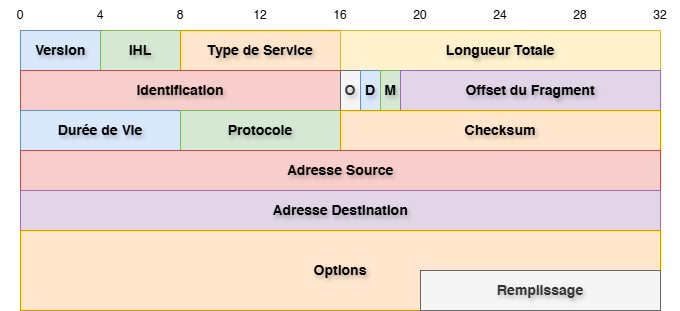

Figure 4 - L'entête d'un datagramme IPv4

- **Version : 4 bits**
    
    Ce champ indique le format de l'entête Internet. Il vaut 4 dans le cas d'un packet IPv4.
    
- **IHL : 4 bits**
    
    La longueur de l'entête Internet (Internet Header Length) est exprimée en mots de 32 bits. La valeur minimale pour une entête correcte est 5.
    
- **Type de service : 8 bits**
    
    Le type de service indique les **paramètres abstraits** de la **qualité de service souhaitée**. Ces paramètres servent à **guider la sélection des paramètres réels** du service lors de la transmission d'un datagramme à travers un réseau particulier.
    
    - Bits 0–2 : Précédence
    - Bit 3 : 0 = Délai normal, 1 = Faible délai
    - Bit 4 : 0 = Débit normal, 1 = Haut débit
    - Bit 5 : 0 = Fiabilité normale, 1 = Haute fiabilité
    - Bits 6–7 : Réservés pour usage futur
    
    Dans de nombreux réseaux, améliorer un paramètre entraîne la dégradation d'un autre. Sauf dans des cas très particuliers, **au plus deux** de ces trois bits devraient être activés.
    


Figure 5 - Champ type de service IPv4

- **Longueur totale : 16 bits**
    
    La longueur totale correspond à la taille du datagramme en octets, incluant l'entête Internet et les données.
    
    Elle permet une taille maximale de 65 535 octets.
    
    Tous les hôtes doivent être capables d'accepter des datagrammes jusqu'à 576 octets.
    
- **Identification : 16 bits**
    
    Valeur attribuée par l'expéditeur pour faciliter la réassemblage des fragments d'un datagramme.
    
- **Drapeaux : 3 bits**
    
    Différents drapeaux de contrôle :
    
    - Bit 0: réservé, doit être zéro
    - Bit 1: (DF) 0 = Fragmentation permise, 1 = Ne pas fragmenter
    - Bit 2: (MF) 0 = Dernier fragment, 1 = Fragments suivants
- **Offset de fragment : 13 bits**
    
    Indique où ce fragment se situe dans le datagramme original. Exprimé en unités de 8 octets (64 bits). Le premier fragment a un offset de zéro.
    
- **Durée de vie (TTL) : 8 bits**
    
    Indique le temps maximum pendant lequel le datagramme peut rester dans le système Internet. Si ce champ vaut zéro, le datagramme doit être détruit. Il est modifié à chaque traitement de l'entête.
    
- **Protocole : 8 bits**
    
    Indique le protocole de niveau supérieur utilisé dans la partie données du datagramme Internet.
    
- **Checksum : 16 bits**
    
    Checksum portant uniquement sur l'entête. Comme certains champs changent (ex. : TTL), elle est **recalculée et vérifiée à chaque traitement.**
    
    Algorithme :
    
    - Le checksum est le complément à un de la somme, elle-même en complément à un, de tous les mots de 16 bits de l'entête. Pour le calcul, le champ de somme de contrôle vaut zéro.
    - Cette somme est simple à calculer et semble adéquate selon les expériences.
- **Adresse source : 32 bits**
    
    Il contient l'adresse de la source.
    
- **Adresse destination : 32 bits**
    
    Il contient l'adresse de la destination.
    
- **Options : Variable**
    
    Les options peuvent être présentes ou non. Elles doivent être implémentées par tous les modules IP, hôtes comme passerelles. Leur présence dans un datagramme particulier est optionnelle, mais leur prise en charge est obligatoire.
    
    Le champ options est de longueur variable. Il peut contenir zéro ou plusieurs options. Deux formats existent :
    
    - Cas 1 : un seul octet représentant le **type d'option**
    - Cas 2 : **type d'option** (1 octet), **longueur** (1 octet), **données de l'option**
    
    Le type d'option comporte trois champs :
    
    - 1 bit : indicateur de copie
    - 2 bits : classe
    - 5 bits : numéro
    - Le bit de copie indique si l'option doit être recopiée dans tous les **fragments** :
        - 0 = non copié
        - 1 = copié
    - Classes :
        - 0 = contrôle
        - 1 = réservé
        - 2 = débogage et mesure
        - 3 = réservé

| Classe | Numéro | Longueur | Description |
| --- | --- | --- | --- |
| 0 | 0 | – | Fin de liste d'options (1 octet) |
| 0 | 1 | – | No-Op (1 octet) |
| 0 | 2 | 11 | Sécurité (codes de sécurité, compartimentation, groupe utilisateur, restrictions) |
| 0 | 3 | var. | Routage source relâché |
| 0 | 9 | var. | Routage source strict |
| 0 | 7 | var. | Enregistrement de route |
| 0 | 8 | 4 | Identifiant de flux |
| 2 | 4 | var. | Horodatage Internet |
- **Padding : Variable**
    
    Padding de l'entête Internet sert à aligner celui-ci sur une limite de 32 bits. Il est constitué de zéros.
    

### d - Limitations : The exhaustion problem

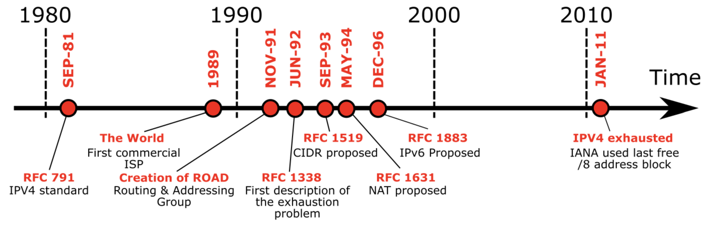

Figure 6 - The exhaustion problem


Figure 7 - L'allocation des plages d'adresses IPv4 par blocs de /8

Pour offrir une flexibilité dans l'attribution des adresses aux réseaux et permettre un grand nombre de réseaux de petite à moyenne taille, l'interprétation du champ d'adresse était codée de manière à spécifier un petit nombre de réseaux avec un grand nombre d'hôtes (classe A), un nombre modéré de réseaux avec un nombre modéré d'hôtes (classe B), et un grand nombre de réseaux avec un petit nombre d'hôtes (classe C).

Cependant, à mesure que l'Internet a évolué et s'est étendu au fil des années, il est devenu évident qu'il allait bientôt faire face à plusieurs problèmes sérieux de passage à l'échelle. Ceux-ci incluent :

1. **L'épuisement de l'espace d'adressage des réseaux de classe B.**
    
    Une cause fondamentale de ce problème est l'absence d'une classe de réseau d'une taille adaptée aux organisations de taille intermédiaire : la classe C, avec un maximum de 254 adresses d'hôtes, est trop petite, tandis que la classe B, qui permet jusqu'à 65 534 adresses, est trop grande pour être largement attribuée.
    
2. **La croissance des tables de routage dans les routeurs Internet**, dépassant la capacité des logiciels de l'époque à les gérer efficacement.
3. **L'épuisement inévitable de l'espace d'adressage IP sur 32 bits.**

### e - Les solutions proposées

- **CIDR :**
    - Le *Classless Inter-Domain Routing* (CIDR) est une méthode d'adressage IP introduite en 1993 (RFC 1519) pour améliorer l'efficacité de l'allocation des adresses et du routage dans les réseaux IPv4.
    - Au lieu d'utiliser le système fixe basé sur les classes (A, B, C), le CIDR permet des préfixes réseau de longueur variable, écrits sous la forme *adresse IP/longueur de préfixe*.
- **NAT :**
    - **En pratique, de nombreux hôtes d'un réseau — parfois même la majorité — n'échangent jamais de trafic avec l'extérieur.** Par conséquent, seules les adresses IP d'un sous-ensemble d'hôtes doivent être converties en adresses IP publiques lorsqu'une communication externe est nécessaire.
    - **Le Network Address Translation (NAT)** permet précisément cela : il convertit plusieurs adresses privées en une seule adresse publique, facilitant l'accès à Internet tout en limitant la consommation d'adresses IPv4.
    - **Lorsqu'un hôte interne envoie un paquet vers l'extérieur, le routeur NAT remplace son adresse IP privée par l'adresse publique et enregistre cette correspondance dans une table de traduction.** À la réception de la réponse, il consulte cette table pour retrouver l'adresse privée de l'hôte et lui transmettre le paquet.

# III - Description de la fragmentation IPv4


Lorsqu'un datagramme IP traverse Internet, il passe par plusieurs réseaux différents. Chaque réseau impose une **taille maximale de paquet** qu'il peut transporter, appelée **MTU (Maximum Transmission Unit)**. Si un datagramme est **plus grand que la MTU** d'un réseau intermédiaire, celui-ci **ne peut pas le transporter tel quel**. **La fragmentation IPv4 découpe alors ce datagramme en fragments plus petits**, chacun respectant la MTU du réseau traversé.

- **Champs utilisés dans la fragmentation**
	- **Identification**
		- Chaque datagramme émis possède un champ **Identification**, choisi par la machine source. Ce champ permet à la destination de savoir **à quel datagramme appartient chaque fragment**.
		- Les fragments issus d'un même datagramme auront donc tous:
			- la même Identification,
			- la même adresse source,
			- la même adresse destination,
			- le même protocole (UDP, TCP...).
		- Ces quatre champs permettent la reconstitution correcte.
	- **Flags**
		- **DF (Don't Fragment)**
			- DF = 1 - le routeur **n'a pas le droit** de fragmenter.
			- Si le paquet dépasse la MTU et DF = 1 - **le paquet est supprimé** et un message ICMP _“Fragmentation Needed”_ est renvoyé à l'émetteur.
		- **MF (More Fragments)**
			- MF = 1 - ce fragment **n'est pas le dernier**.
			- MF = 0 - c'est **le dernier fragment** du datagramme.
	- **Fragment Offset**
		- Chaque fragment contient un champ **Fragment Offset**, qui indique **où commence sa partie utile** dans le datagramme d'origine.
		- L'offset n'est pas exprimé en octets, mais en **blocs de 8 octets**. Donc la taille des fragments **doit être un multiple de 8**, sauf pour le dernier fragment.

- **Reconstruction côté destination**
	- La reconstitution **s'effectue uniquement à la destination**, jamais en chemin.
	- La machine reçoit les différents fragments et elle les regroupe selon leur:
	    - Identification
	    - Adresse source
	    - Adresse destination
	    - Protocole
	- Elle place chaque fragment dans un buffer à la position indiquée par le **Fragment Offset**.
	- La reconstruction est terminée lorsque :
	    - elle a reçu le fragment avec **MF = 0** (le dernier),
	    - et que tous les octets entre l'offset 0 et la fin sont présents.
	- Si un fragment manque après un délai maximum, **toute la reconstitution échoue** et le datagramme est perdu.

Pour illustrer le fonctionnement de la fragmentation IPv4, nous reprenons l'exemple présenté en cours :

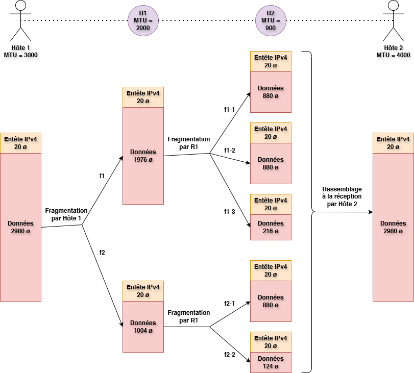

Figure 8 - Exemple de la fragmentation IPv4


| **f1**     | **Position Relative** | **D**   | **M**   | **Longeur Totale** |
| ------ | ----------------- | --- | --- | -------------- |
| **f1.1.1** | 0                 | 0   | 1   | 900            |
| **f1.1.2** | 110               | 0   | 1   | 900            |
| **f1.1.3** | 220               | 0   | 1   | 236            |
| **f1.2.1** | 247               | 0   | 1   | 900            |
| **f1.2.2** | 357               | 0   | 0   | 144            |


# IV - Description du protocole IPv6

## 1) Définition

**IPv6** (Internet Protocol version 6) est la version la plus récente de IP (Internet Protocol) conçue pour être le successeur de IPv4.

Certaines demandes ont possé la création de IPv6 pour traiter les lacunes de IPv4. Ces améliorations tombent dans les catégories suivantes :

- **Capacités d'adressage étendues :** IPv6 passe de 32 à 128 bits, permettant plus de niveaux hiérarchiques, un nombre plus élevé d'adresses (2^128 contre 2^32) et une autoconfiguration simplifiée. Le routage multicast est amélioré grâce au champ « scope », et les adresses anycast permettent d'envoyer un paquet vers n'importe quel nœud d'un groupe.
- **Simplification de l'entête :** Certains champs IPv4 ont été supprimés ou rendus optionnels, réduisant le coût de traitement et la taille de l'entête IPv6.
- **Meilleur support des extensions et options :** L'encodage des options permet un routage plus efficace, des options plus longues et une flexibilité pour de futures extensions.
- **Étiquetage de flux :** IPv6 peut identifier des séquences de paquets comme un flux unique pour un traitement cohérent dans le réseau.
- **Sécurité et confidentialité :** IPv6 inclut des extensions pour l'authentification, l'intégrité des données et, optionnellement, la confidentialité.

Ces améliorations sont rendues possibles par la nouvelle structure de l'entête IPv6, qui sera détaillée dans la section suivante.

## 2) Implémentation

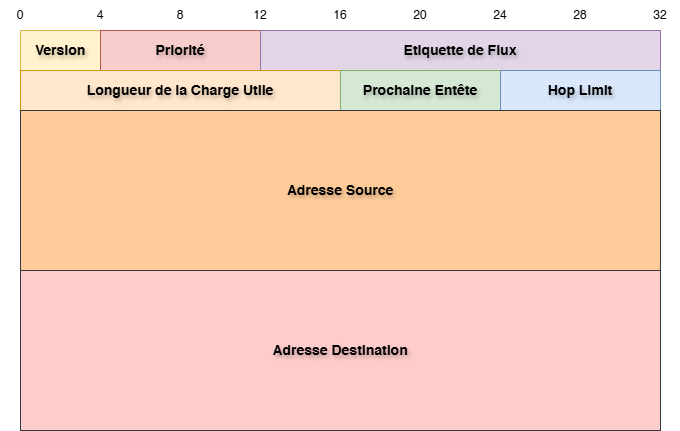

Figure 9 - L'entête d'un datagramme IPv6

- **Version :** **4 bits**
    
    Il contient la version de IP utilisée (sa valeur est 0110 pour IPv6)
    
- **Priorité : 8 bits**
    
    Il sert à indiquer la priorité et le type de traitement d'un paquet dans le réseau.
    
- **Etiquette de Flux :** **20 bits**
    
    Il est utilisé par la source pour grouper une séquence de paquets qui doivent être traitées comme un seul flux dans le réseau.
    
- **Longueur de la Charge Utile :** **16 bits**
    
    Il contient la longueur de la charge utile du datagramme, qui est la partie qui se trouve au dessous de ce champ (extensions + données).
    
- **Prochaine Entête :** **8 bits**
    
    Il sert à identifier le type de l'entête qui se trouve directement après l'entête IPv6.
    
- **Hop Limit :** **8 bits**
    
    Il est décrémenté de 1 par chaque nœud qui l'envoie. Si ce champ est déjà à 0 à la reception ou est décrémenté à 0, le paquet est rejeté par le nœud. Le nœud de destination ne rejette pas le paquet si ce champ est égal à 0.
    
- **Adresse Source :** **128 bits**
    
    Il contient l'adresse de la source.
    
- **Adresse Destination :** **128 bits**
    
    Il contient l'adresse de la destination.
    

Après avoir détaillé le format du datagramme IPv6, il est important d'examiner les extensions, qui permettent d'ajouter des fonctionnalités supplémentaires au protocole.

## 3) Extensions

En IPv6, les informations optionnelles de la couche Internet sont codées dans des entêtes d'extension, insérées entre l'entête IPv6 et l'entête de la couche supérieure. Il en existe un nombre limité, chacun identifié par une valeur **Prochaine Entête** spécifique.

Lors du traitement d'une séquence de **Prochaine Entête**, le premier qui n'est pas une entête d'extension indique que l'élément suivant est l'entête de la couche supérieure. Une valeur spéciale **No Next Header** est utilisée lorsqu'il n'y a pas d'entête de couche supérieure.

Comme illustré dans cette figure, un paquet IPv6 peut contenir zéro, un ou plusieurs entêtes d'extension identifiés par le champ **Prochaine Entête** de l'entête précédente :

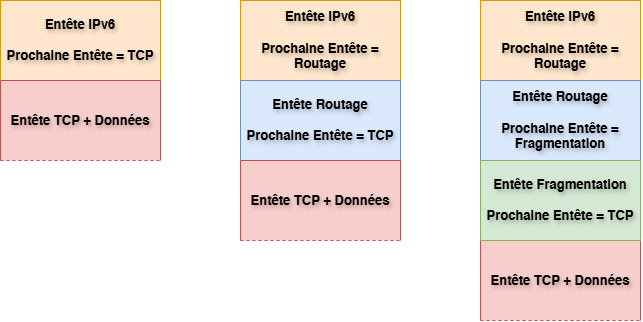

Figure 10 - Enchainement des entêtes dans IPv6

Au nœud destinataire, le champ **Prochaine Entête** de l'entête IPv6 permet d'invoquer le module traitant la première entête d'extension, ou l'entête de la couche supérieure s'il n'y a pas d'extension. Chaque entête d'extension doit être traitée dans l'ordre, car son contenu détermine si le traitement doit passer à la suivante. Il est interdit de sauter une entête pour en traiter une autre plus loin dans le paquet.

Si un nœud doit passer à l'entête suivante mais rencontre une valeur **Prochaine Entête** inconnue, le paquet doit être supprimé et un message ICMP « Parameter Problem » envoyé à la source, avec le code 1 et le pointeur indiquant l'emplacement de la valeur non reconnue. La même procédure s'applique si une valeur 0 est trouvée dans une entête autre que l'entête IPv6.

Chaque entête d'extension est un multiple de 8 octets pour garantir l'alignement des entêtes suivantes. Les champs multi-octets sont alignés sur leurs bornes naturelles (1, 2, 4 ou 8 octets).

Une implémentation complète d'IPv6 contient les entêtes d'extension suivantes :

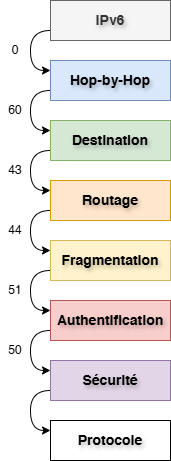

Figure 11 - Ordre des extensions en IPv6

Dans ce rapport, on s'intéressera à l'extension **Fragmentation**.

# V - Description de la fragmentation IPv6

## 1) Extension de la fragmentation

Afin de permettre l'envoi de données de taille supérieure à l'MTU (Maximum Transfer Unit) du chemin, IPv6 utilise l'extension de fragmentation.

Contrairement à IPv4, la fragmentation en IPv6 se fait de bout en bout (fragmentation à la source et rassemblage à la destination).

Elle se fait grâce à l'entête fragmentation qui a la forme suivante :

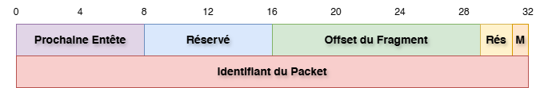

Figure 12 - L'entête de fragmentation en IPv6

- **Prochaine Entête :** **8 bits.**
    
    Il sert à identifier le type de l'entête qui se trouve directement après l'entête fragmentation.
    
- **Réservé :** **8 bits réservés.**
    
    Il est initialisé à 0 lors de la transmission.
    
- **Offset du Fragment :** **13 bits.**
    
    Il contient la position relative du fragment en mots de 8 octets par rapport aux autres fragments, permettant le rassemblage.
    
- **Rés :** **2 bits réservés.**
    
    Il est initialisé à 0 lors de la transmission.
    
- **M (More Fragment) :** **Drapeau de 1 bit.**
    
    Il est mis à 0 s'il s'agit du dernier fragment, sinon, il est mis à 1.
    
- **Identifiant du Packet :** **32 bits.**
    
    Il contient le nombre d'ordre du datagramme IPv6 originaire du fragment, il est utilisé lors du rassemblage.
    

Si la taille d'un datagramme est supérieure à l'MTU, la source commence par lui associer un **Identifiant**. Puis, elle divise la partie des données et associe à chacune une copie de l'entête IPv6 et une extension fragmentation :

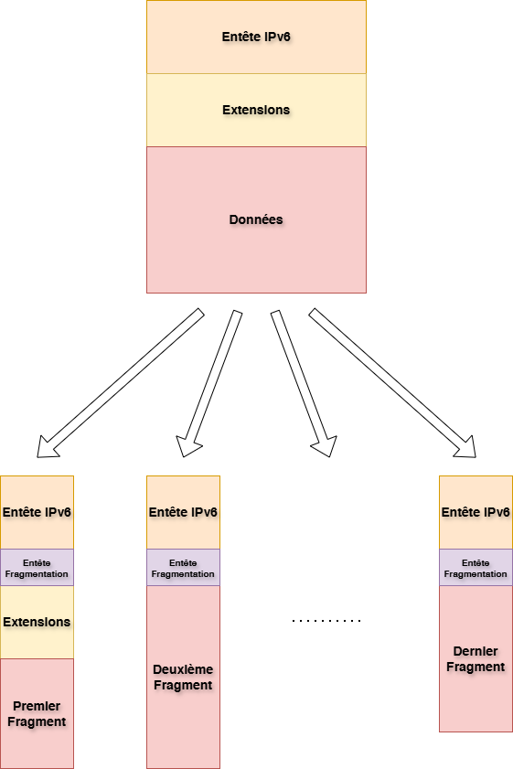

Figure 13 - Fragmentation en IPv6

## 2) Recherche du MTU

Pour permettre cette opération, la source doit connaître l'MTU du chemin. Elle peut faire ceci par deux méthodes :

- **Utilisation d'un MTU minimal standard :**

L'une des deux techniques utilisés pour la fragmentation des datagrammes IPv6 est l'adoption d'un MTU standard minimal connu par tout le monde qui est de **1280 octets**.

- **Découverte du MTU :**

L'autre technique consiste à envoyer des paquets dans le chemin et utiliser les messages d'erreur afin de déterminer son MTU :

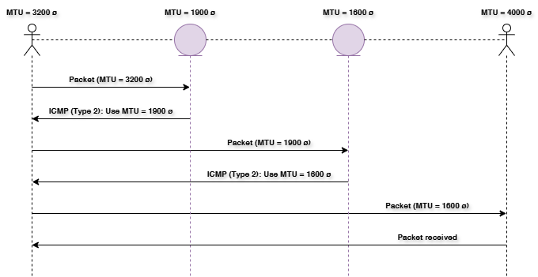

Figure 14 - Processus de découverte du MTU en IPv6

## 3) Exemple

Pour illustrer le fonctionnement de la fragmentation IPv6, on propose de prendre un exemple où on désire envoyer **4000 octets** de données, sans extensions, à travers un chemin qui utilise un MTU standard (**1280 octets**) :

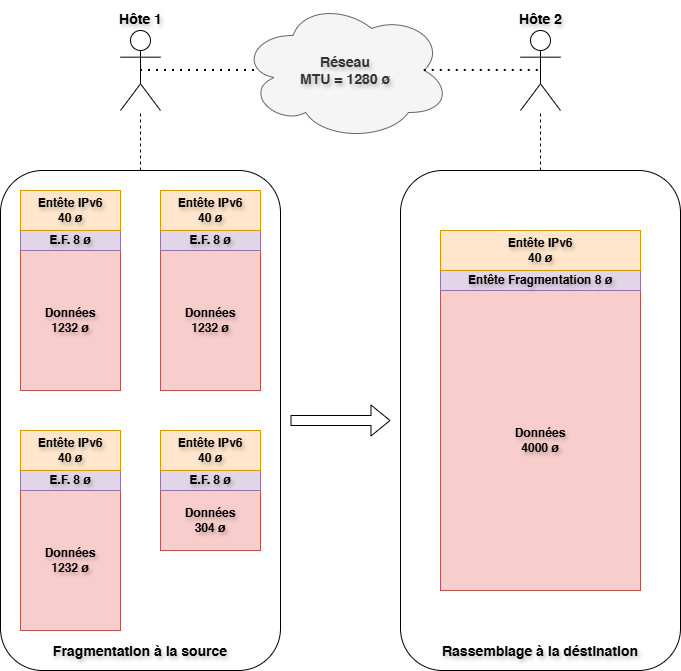

Figure 15 - Exemple de la fragmentation IPv6

| **Fragments** | **Longueur de la Charge Utile** | **Offset du Fragment** | **M** | **Identifiant** |
| --- | --- | --- | --- | --- |
| **f1** | 1240 | 0 | 1 | 256 |
| **f2** | 1240 | 154 | 1 | 256 |
| **f3** | 1240 | 308 | 1 | 256 |
| **f4** | 312 | 462 | 0 | 256 |

# VI - Conclusion

L'étude des protocoles IPv4 et IPv6 met en évidence la manière dont les technologies réseau évoluent pour répondre à des besoins toujours croissants en matière d'adressage, de performance et de fiabilité. IPv4, conçu à une époque où l'Internet n'était encore qu'un projet expérimental, a démontré une longévité remarquable. Toutefois, des limites structurelles ont rendu incontournable la conception d'un successeur plus adapté à l'Internet contemporain.

IPv6 répond à ces défis en proposant une architecture simplifiée, un espace d'adresses considérablement étendu et un traitement plus efficace des paquets. Malgré ces avantages, son déploiement demeure progressif et dépend de nombreux facteurs techniques, économiques et organisationnels.

# VII - Bibliographie

- J. Postel, *RFC 791 - Internet Protocol*, DARPA, September 1981. [https://www.rfc-editor.org/rfc/rfc791.html](https://www.rfc-editor.org/rfc/rfc791.html)
- Stephen E. Deering, *RFC 8200 - Internet Protocol, Version 6 (IPv6) Specification*, July 2017. [https://www.rfc-editor.org/rfc/rfc8200.html](https://www.rfc-editor.org/rfc/rfc8200.html)
- G. Huston, *IPv4 Address Report* [https://ipv4.potaroo.net/](https://ipv4.potaroo.net/)
- Computer History, *Internet History of 1980s* [https://www.computerhistory.org/internethistory/1980s/](https://www.computerhistory.org/internethistory/1980s)
- Wikipedia, *IPv4*
- Wikipedia, *IPv6*