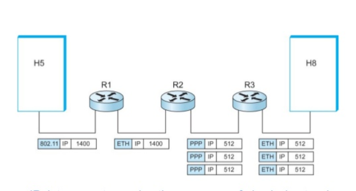

# Chapitre I — Description du protocole IPv4
## 1 - Motivation

### A) Le préexistant (1960 – 1980):

- Les réseaux étaient principalement **petits** et **isolés**:
	- Les ordinateurs utilisaient souvent des noms d’hôtes ou des **identifiants propres à chaque machine.**
	- La communication se faisait surtout via des liens point-à-point dédiés ou des réseaux à commutation de paquets **très réduits.**
- Il n’existait pas encore de **pile réseaux** entièrement standardisée.


---
### B) Limitations des réseaux à l’époque:

- **Limites de scalabilité:**
	- Ne possédait pas des fonctions comme l’adressage hiérarchique ou le routage flexible.
	- Ne pouvaient supporter efficacement que quelques dizaines à quelques centaines de machines.
- **Normalisation de la communication:**
	- Les machines avaient des architectures différentes.
	- Chacune avait sa propre manière d’envoyer et d’interpréter les données.

---
### C) L’émergence de IPv4:

- **Routage inter-réseaux:**
	- IPv4 a introduit des réseaux logiques par-dessus les réseaux physiques.
	- Les passerelles (plus tard appelées routeurs) pouvaient connecter plusieurs réseaux, transférer des paquets en fonction des adresses IP, et masquer les différences entre les technologies de liaison sous-jacentes.
- **Adressage standardisé:**
	- Chaque hôte recevait une adresse IP de 32 bits.
	- La structure hiérarchique (ID réseau + ID hôte) permettait le routage sur de multiples réseaux.
	- Elle rendait possible une attribution d’adresses évolutive et organisée.
- **Format de paquet:** 
	- IPv4 définissait un en-tête universel et des règles de fragmentation, de routage et de livraison.
	- Les routeurs pouvaient lire un paquet IPv4 indépendamment du réseau physique sous-jacent.

---
### D) Intégration dans les architectures préexistantes:

- **Approche basée sur les passerelles:**
	- Les réseaux existants sont restés inchangés.
	- Des machines spécialisées, les passerelles, connectaient les réseaux.
	- Les passerelles convertissaient entre les protocoles locaux et les paquets IPv4.
- **La pile TCP/IP:**
	- **Standardisation d’IPv4 (1981):**
		- RFC 791 définissait IPv4.
		- RFC 793 définissait TCP.
	- Ensemble, ils formaient la pile TCP/IP: IP comme couche réseau, TCP comme couche transport.


---
## 2 - Implementation
### A) Le module internet:

- Ce protocole est appelé par les protocoles hôte-à-hôte dans un environnement Internet.
- Ce protocole appelle les protocoles de réseau local pour transporter le datagramme Internet vers la passerelle suivante ou l’hôte de destination.

- Un module Internet doit fournir un ensemble minimal de services pour garantir que toutes les implémentations puissent supporter la même hiérarchie de protocoles.
- Comme le protocole Internet est un protocole de datagrammes, il n’y a qu’un minimum de mémoire conservé entre les transmissions. Chaque appel au module IP par l’utilisateur fournit toutes les informations nécessaires pour que l’IP exécute le service demandé.

- **Un exemple d’interface fictive de niveau supérieur:**

```c
void SEND(src, dst, prot, TOS, TTL, BufPTR, len, Id, DF, opt => result)
where:
	src = source address
	dst = destination address
	prot = protocol
	TOS = type of service
	TTL = time to live
	BufPTR = buffer pointer
	len = length of buffer
	Id  = Identifier
	DF = Don't Fragment
	opt = option data
	result = response
		OK = datagram sent ok
		Error = error in arguments or local network error
```

- Si les arguments sont valides et que le datagramme est accepté par le réseau local, l’appel se termine avec succès.  
- Si les arguments sont invalides ou si le datagramme n’est pas accepté par le réseau local, l’appel échoue.  
- En cas d’échec, un rapport raisonnable doit être fourni concernant la cause du problème, mais les détails de ces rapports dépendent des implémentations individuelles.

```c
void RECV (BufPTR, prot, => result, src, dst, TOS, len, opt)
where:
	BufPTR = buffer pointer
	prot = protocol
	result = response
		OK = datagram received ok
		Error = error in arguments
	len = length of buffer
	src = source address
	dst = destination address
	TOS = type of service
	opt = option data
```

- Lorsqu’un datagramme arrive dans le module du protocole Internet depuis le réseau local, soit un appel RECV correspondant de l’utilisateur concerné est en attente, soit il n’y en a pas.  
- Dans le premier cas, l’appel en attente est satisfait en transmettant les informations du datagramme à l’utilisateur.  
- Dans le second cas, l’utilisateur concerné est notifié de la présence d’un datagramme en attente.  
- Si l’utilisateur concerné n’existe pas, un message d’erreur ICMP est renvoyé à l’expéditeur et les données sont abandonnées.

---
### B) Packet flow:

Le modèle de fonctionnement pour transmettre un datagramme d’un programme applicatif à un autre est illustré par le scénario suivant :

- On suppose que cette transmission impliquera une passerelle intermédiaire.
    
- Le programme applicatif émetteur prépare ses données et fait appel à son module Internet local pour envoyer ces données sous forme de datagramme, en lui fournissant l’adresse de destination et d’autres paramètres comme arguments de l’appel.
    
- Le module Internet prépare un en-tête de datagramme et y attache les données. Il détermine ensuite une adresse de réseau local correspondant à l’adresse Internet, dans ce cas l’adresse d’une passerelle. Il envoie ce datagramme et l’adresse de réseau local à l’interface de réseau local.
    
- L’interface de réseau local crée un en-tête de réseau local, y attache le datagramme, puis envoie l’ensemble via le réseau local.
    
- Le datagramme arrive sur la machine passerelle encapsulé dans l’en-tête de réseau local. L’interface de réseau local retire cet en-tête et remet le datagramme au module Internet.
    
- Le module Internet détermine, à partir de l’adresse Internet, que le datagramme doit être retransmis vers un autre hôte sur un second réseau. Il calcule l’adresse de réseau local de l’hôte de destination, puis fait appel à l’interface du réseau local correspondant pour envoyer le datagramme.
    
- Cette interface de réseau local crée un en-tête de réseau local, y attache le datagramme et envoie l’ensemble vers l’hôte de destination. Sur cet hôte, l’interface de réseau local retire l’en-tête et remet le datagramme au module Internet.
    
- Le module Internet détermine que le datagramme est destiné à un programme applicatif de cet hôte. Il transmet alors les données au programme applicatif en réponse à un appel système, en fournissant l’adresse source et d’autres paramètres comme résultats de l’appel.

- **Passerelles**  
	- Les passerelles implémentent le protocole Internet afin de transférer des datagrammes entre les réseaux.
	- Elles implémentent également le _Gateway to Gateway Protocol_ (GGP), pour coordonner le routage et d’autres informations de contrôle au sein de l’Internet.
	- Dans une passerelle, les protocoles de niveau supérieur n’ont pas besoin d’être implémentés, et les fonctions du GGP sont ajoutées au module IP.

---
### C)Packet structure:

- **Version : 4 bits**  
	- Ce champ indique le format de l'en-tête Internet. vaut 4 pour IPv4.

- **IHL : 4 bits**  
	- La longueur de l’en-tête Internet (Internet Header Length) est exprimée en mots de 32 bits. La valeur minimale pour un en-tête correct est 5.

- **Type de service : 8 bits**  
	- Le type de service indique les paramètres abstraits de la qualité de service souhaitée. Ces paramètres servent à guider la sélection des paramètres réels du service lors de la transmission d’un datagramme à travers un réseau particulier. Plusieurs réseaux offrent une précédence de service, traitant le trafic de haute précédence comme plus important que les autres (souvent en acceptant uniquement le trafic au-dessus d’un certain niveau lors de fortes charges). Le choix principal est un compromis à trois voies entre faible délai, haute fiabilité et haut débit.

- Bits 0–2 : Précédence
- Bit 3 : 0 = Délai normal, 1 = Faible délai
- Bit 4 : 0 = Débit normal, 1 = Haut débit
- Bit 5 : 0 = Fiabilité normale, 1 = Haute fiabilité
- Bits 6–7 : Réservés pour usage futur

```
  0     1     2     3     4     5     6     7
+-----+-----+-----+-----+-----+-----+-----+-----+
|                 |     |     |     |     |     |
|   PRECEDENCE    |  D  |  T  |  R  |  0  |  0  |
|                 |     |     |     |     |     |
+-----+-----+-----+-----+-----+-----+-----+-----+
```

- L’utilisation des indications de délai, de débit et de fiabilité peut augmenter le « coût » du service. Dans de nombreux réseaux, améliorer un paramètre entraîne une dégradation d’un autre. Sauf cas très particuliers, au plus deux de ces trois bits devraient être activés.

---

- **Longueur totale : 16 bits**  
	- La longueur totale correspond à la taille du datagramme en octets, incluant l’en-tête Internet et les données. Elle permet une taille maximale de 65 535 octets. Tous les hôtes doivent être capables d’accepter des datagrammes jusqu’à 576 octets (entiers ou fragmentés). Il est recommandé d’envoyer des datagrammes plus grands que 576 octets uniquement si l’on sait que la destination pourra les accepter.

---

- **Identification : 16 bits**  
	- Valeur attribuée par l’expéditeur pour faciliter la réassemblage des fragments d’un datagramme.

---

- **Drapeaux : 3 bits**  
	- Différents drapeaux de contrôle.
		- Bit 0 : réservé, doit être zéro
		- Bit 1 : (DF) 0 = Fragmentation permise, 1 = Ne pas fragmenter
		- Bit 2 : (MF) 0 = Dernier fragment, 1 = Fragments suivants

```
  0   1   2
+---+---+---+
|   | D | M |
| 0 | F | F |
+---+---+---+
```

---

- **Offset de fragment : 13 bits**  
	- Indique où ce fragment se situe dans le datagramme original. Exprimé en unités de 8 octets (64 bits). Le premier fragment a un offset de zéro.

---

- **Durée de vie (TTL) : 8 bits**  
	- Indique le temps maximum pendant lequel le datagramme peut rester dans le système Internet. Si ce champ vaut zéro, le datagramme doit être détruit. Il est modifié à chaque traitement de l’en-tête.  
	- L’objectif est de supprimer les datagrammes non livrables et de limiter leur durée de vie dans le réseau.

---

- **Protocole : 8 bits**  
	- Indique le protocole de niveau supérieur utilisé dans la partie données du datagramme Internet.

---

- **Checksum: 16 bits**  
	- Checksum portant uniquement sur l’en-tête. Comme certains champs changent (ex. : TTL), elle est recalculée et vérifiée à chaque traitement.
	
	- Algorithme:  
		- La somme de contrôle est le complément à un de la somme, elle-même en complément à un, de tous les mots de 16 bits de l’en-tête. Pour le calcul, le champ de somme de contrôle vaut zéro.
		- Cette somme est simple à calculer et semble adéquate selon les expériences.

---

- **Adresse source : 32 bits**  
	- Adresse source. Voir section 3.2.

- **Adresse destination : 32 bits**  
	- Adresse destination. Voir section 3.2.

---

- **Options**  
	- Les options peuvent être présentes ou non. Elles doivent être implémentées par tous les modules IP, hôtes comme passerelles. Leur présence dans un datagramme particulier est optionnelle, mais leur prise en charge est obligatoire.
	- Le champ options est de longueur variable. Il peut contenir zéro ou plusieurs options. Deux formats existent :
		- Cas 1 : un seul octet représentant le type d’option
		- Cas 2 : type d’option (1 octet), longueur (1 octet), données de l’option
		
	- Le type d’option comporte trois champs :
		- 1 bit : indicateur de copie
		- 2 bits : classe
		- 5 bits : numéro

		- Le bit de copie indique si l’option doit être recopiée dans tous les fragments:
			- 0 = non copié  
			- 1 = copié

		- Classes:
			0 = contrôle  
			1 = réservé  
			2 = débogage et mesure  
			3 = réservé

|Classe|Numéro|Longueur|Description|
|---|---|---|---|
|0|0|–|Fin de liste d’options (1 octet)|
|0|1|–|No-Op (1 octet)|
|0|2|11|Sécurité (codes de sécurité, compartimentation, groupe utilisateur, restrictions)|
|0|3|var.|Routage source relâché|
|0|9|var.|Routage source strict|
|0|7|var.|Enregistrement de route|
|0|8|4|Identifiant de flux|
|2|4|var.|Horodatage Internet|


---

- **Padding : variable**  
	- Padding de l’en-tête Internet sert à aligner celui-ci sur une limite de 32 bits. Il est constitué de zéros.

---
### D) Limitations: The exhaustion problem


Pour offrir une flexibilité dans l’attribution des adresses aux réseaux et permettre un grand nombre de réseaux de petite à moyenne taille, l’interprétation du champ d’adresse est codée de manière à spécifier un petit nombre de réseaux avec un grand nombre d’hôtes (classe A), un nombre modéré de réseaux avec un nombre modéré d’hôtes (classe B), et un grand nombre de réseaux avec un petit nombre d’hôtes (classe C).

Cependant, à mesure que l’Internet a évolué et s’est étendu au fil des années, il est devenu évident qu’il allait bientôt faire face à plusieurs problèmes sérieux de passage à l’échelle. Ceux-ci incluent :

1. **L’épuisement de l’espace d’adressage des réseaux de classe B.**  
    Une cause fondamentale de ce problème est l’absence d’une classe de réseau d’une taille adaptée aux organisations de taille intermédiaire : la classe C, avec un maximum de 254 adresses d’hôtes, est trop petite, tandis que la classe B, qui permet jusqu’à 65 534 adresses, est trop grande pour être largement attribuée.
    
2. **La croissance des tables de routage dans les routeurs Internet**, dépassant la capacité des logiciels de l’époque (et des administrateurs) à les gérer efficacement.
    
3. **L’épuisement inévitable de l’espace d’adressage IP sur 32 bits.**

---
### E) Les solutions proposées:

- **CIDR :**  
	- Le _Classless Inter-Domain Routing_ (CIDR) est une méthode d’adressage IP introduite en 1993 (RFC 1519) pour améliorer l’efficacité de l’allocation des adresses et du routage dans les réseaux IPv4.  
	- Au lieu d’utiliser le système fixe basé sur les classes (A, B, C), le CIDR permet des préfixes réseau de longueur variable — écrits sous la forme _adresse IP/longueur de préfixe_ (par exemple : 192.168.0.0/20).

- **NAT :**  
	- Cette solution tire parti du fait qu’un très faible pourcentage d’hôtes dans un domaine _stub_ communiquent en dehors de ce domaine à un instant donné.  
	- Un domaine _stub_ est un domaine — comme un réseau d’entreprise — qui ne gère que le trafic provenant ou destiné aux hôtes internes.
	
	- En réalité, beaucoup d’hôtes (voire la majorité) ne communiquent jamais en dehors de leur domaine _stub_. Pour cette raison, seul un sous-ensemble des adresses IP internes doit être traduit en adresses IP globalement uniques lorsque des communications externes sont nécessaires.

---
# Chapitre III — Description de la fragmentation IPv4



La fonction ou la finalité du protocole Internet est d’acheminer des datagrammes à travers un ensemble interconnecté de réseaux. Cela se fait en transférant les datagrammes d’un module internet à un autre jusqu’à ce que la destination soit atteinte. Les modules internet résident dans les hôtes et les passerelles du système internet. Les datagrammes sont acheminés d’un module internet à un autre à travers des réseaux individuels, sur la base de l’interprétation d’une adresse internet. Ainsi, l’un des mécanismes essentiels du protocole Internet est l’adresse internet.

Lors de l’acheminement des messages d’un module internet à un autre, il peut être nécessaire que les datagrammes traversent un réseau dont la taille maximale de paquet est inférieure à la taille du datagramme. Pour contourner cette difficulté, un mécanisme de fragmentation est prévu dans le protocole Internet.

Un datagramme internet peut être marqué “ne pas fragmenter”. Tout datagramme portant cette indication ne doit en aucun cas être fragmenté par le protocole Internet. Si un datagramme ainsi marqué ne peut pas être livré à sa destination sans être fragmenté, il doit être abandonné.

Le champ d’identification est utilisé pour distinguer les fragments d’un datagramme de ceux d’un autre. Le module de protocole émetteur d’un datagramme internet assigne au champ d’identification une valeur qui doit être unique pour cette paire source–destination et ce protocole, pendant toute la durée durant laquelle le datagramme reste actif dans le système internet. Le module de protocole émetteur d’un datagramme complet positionne l’indicateur “plus de fragments” à zéro et l’offset de fragment à zéro.

Cette procédure peut être généralisée à une division en _n_ fragments, plutôt qu’à la division en deux fragments décrite.

Pour réassembler les fragments d’un datagramme internet, un module du protocole Internet (par exemple sur un hôte de destination) combine les datagrammes internet qui ont la même valeur pour les quatre champs : identification, source, destination et protocole. La combinaison est effectuée en plaçant la partie données de chaque fragment à la position relative indiquée par l’offset de fragment dans l’en-tête internet de ce fragment. Le premier fragment possède un offset de fragment égal à zéro, et le dernier fragment a l’indicateur “plus de fragments” remis à zéro.

