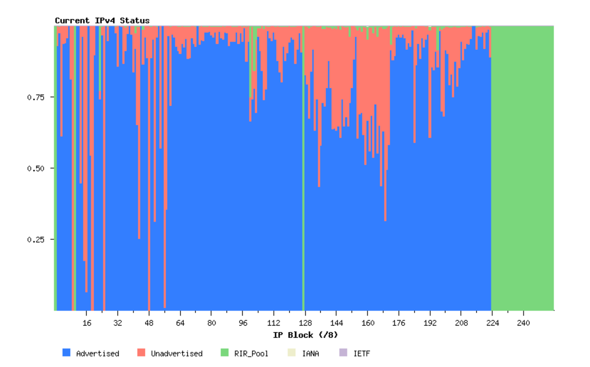

# Plan
# Introdution
# Chapitre I — Description du protocole IPv4
## 1 - Motivation
### A) Le préexistant (1960 – 1980)
### B) Limitations des réseaux à l’époque
### C) L’émergence de IPv4
## 2 - Implementation
### A) Le module internet
### B) Packet flow
### C) Packet structure
### D) Limitations: The exhaustion problem
### E) Les solutions proposées
# Chapitre II — Description du protocole IPv6
## 1 - Introduction
## 2 - Entête IPv6
## 3 - Extensions en IPv6
# Chapitre III — Description de la fragmentation IPv4
# Chapitre IV — Description de la fragmentation IPv6
## 1 - Utilisation d’un MTU minimal standard
## 2 - Découverte du MTU
# Chapitre V — Comparaison entre IPv4 et IPv6
# Conclusion
# Bibliographie

---
# Introduction

L’architecture de l’Internet moderne repose sur un ensemble de protocoles standardisés, dont le rôle principal est de permettre l’interconnexion de réseaux hétérogènes à grande échelle. Parmi ces protocoles, IPv4 et IPv6 occupent une place centrale dans le fonctionnement de l’Internet, puisqu’ils définissent la manière dont les machines s’identifient et échangent des données à travers le réseau mondial.

Le présent rapport analyse les mécanismes internes des protocoles IPv4 et IPv6, de la structure des paquets et des differentes techniques de fragmentation.

---
# Chapitre I — Description du protocole IPv4
## 1 - Motivation

### A) Le préexistant (1960 – 1980):

- Les réseaux étaient principalement **petits** et **isolés**:
	- Les ordinateurs utilisaient souvent des noms d’hôtes ou des **identifiants propres à chaque machine.**
	- La communication se faisait surtout via des liens point-à-point dédiés ou des réseaux à commutation de paquets **très réduits.**
- Il n’existait pas encore de **pile réseaux** entièrement standardisée.


---
### B) Limitations des réseaux à l’époque:

- **Limites de scalabilité:**
	- Ne possédait pas des fonctions comme l’**adressage hiérarchique** ou le routage flexible.
	- Ne pouvaient supporter efficacement que quelques dizaines à **quelques centaines de machines.**
- **Normalisation de la communication:**
	- Les machines avaient des **architectures différentes.**
	- Chacune avait sa propre manière d’envoyer et d’interpréter les données.

---
### C) L’émergence de IPv4:

- **Routage inter-réseaux:**
	- IPv4 a introduit des **réseaux logiques** par-dessus les réseaux physiques.
	- Les réseaux existants sont restés inchangés. Des machines spécialisées, les passerelles (plus tard appelées routeurs), connectaient les réseaux. Elles convertissaient entre les protocoles locaux et les paquets IPv4.
- **Adressage standardisé:**
	- Chaque hôte recevait une adresse IP de 32 bits.
	- La structure hiérarchique (ID réseau + ID hôte) permettait le routage sur de multiples réseaux.
- **Format de paquet:** 
	- IPv4 définissait un en-tête universel et des règles de fragmentation, de routage et de livraison.
	- Les routeurs pouvaient lire un paquet IPv4 indépendamment du réseau physique sous-jacent.
- **La pile TCP/IP:**
	- **Standardisation d’IPv4 (1981):**
		- RFC 791 définissait IPv4.
		- RFC 793 définissait TCP.
	- Ensemble, ils formaient la pile TCP/IP: IP comme couche réseau, TCP comme couche transport.


---
## 2 - Implementation
### A) Le module internet:

- IPv4 est appelé par les protocoles hôte-à-hôte dans un environnement Internet et il appelle les protocoles de réseau local pour transporter le datagramme Internet vers la passerelle suivante ou l’hôte de destination.

- Comme le protocole Internet est un protocole de datagrammes, il n’y a qu’un minimum de mémoire conservé entre les transmissions. Chaque appel au module IP par l’utilisateur fournit toutes les informations nécessaires pour que l’IP exécute le service demandé.

- **Une interface fictive d'un module internet:**

```c
void SEND(src, dst, prot, TOS, TTL, BufPTR, len, Id, DF, opt => result)
where:
	src = source address
	dst = destination address
	prot = protocol
	TOS = type of service
	TTL = time to live
	BufPTR = buffer pointer
	len = length of buffer
	Id  = Identifier
	DF = Don't Fragment
	opt = option data
	result = response
		OK = datagram sent ok
		Error = error in arguments or local network error
```

- Si les arguments sont valides et que le datagramme est accepté par le réseau local, l’appel se termine avec succès.  
- En cas d’échec, un rapport raisonnable doit être fourni concernant la cause du problème, mais les détails de ces rapports dépendent des implémentations individuelles.

```c
void RECV(BufPTR, prot, => result, src, dst, TOS, len, opt)
where:
	BufPTR = buffer pointer
	prot = protocol
	result = response
		OK = datagram received ok
		Error = error in arguments
	len = length of buffer
	src = source address
	dst = destination address
	TOS = type of service
	opt = option data
```

- Lorsqu’un datagramme arrive dans le module du protocole Internet depuis le réseau local, soit un appel RECV correspondant de l’utilisateur concerné est en attente, soit il n’y en a pas:
	- Dans le premier cas, l’appel en attente est satisfait en transmettant les informations du datagramme à l’utilisateur.  
	- Dans le second cas, l’utilisateur concerné est notifié de la présence d’un datagramme en attente.  
- Si l’utilisateur concerné n’existe pas, un message d’erreur **ICMP** est renvoyé à l’expéditeur et les données sont abandonnées.

---
### B) Packet flow:

- Le programme applicatif émetteur prépare ses données et fait appel à son module Internet local pour envoyer ces données sous forme de datagramme, en lui fournissant l’adresse de destination et d’autres paramètres comme arguments de l’appel.
    
- Le module Internet prépare un en-tête de datagramme et y attache les données. Il détermine ensuite une adresse de réseau local correspondant à l’adresse Internet, dans ce cas l’adresse d’une passerelle. Il envoie ce datagramme et l’adresse de réseau local à l’interface de réseau local.
    
- L’interface de réseau local crée un en-tête de réseau local, y attache le datagramme, puis envoie l’ensemble via le réseau local.
    
- Le datagramme arrive sur la machine passerelle encapsulé dans l’en-tête de réseau local. L’interface de réseau local retire cet en-tête et remet le datagramme au module Internet.
    
- Le module Internet détermine, à partir de l’adresse Internet, que le datagramme doit être retransmis vers un autre hôte sur un second réseau. Il calcule l’adresse de réseau local de l’hôte de destination, puis fait appel à l’interface du réseau local correspondant pour envoyer le datagramme.
    
- Cette interface de réseau local crée un en-tête de réseau local, y attache le datagramme et envoie l’ensemble vers l’hôte de destination. Sur cet hôte, l’interface de réseau local retire l’en-tête et remet le datagramme au module Internet.
    
- Le module Internet détermine que le datagramme est destiné à un programme applicatif de cet hôte. Il transmet alors les données au programme applicatif en réponse à un appel système, en fournissant l’adresse source et d’autres paramètres comme résultats de l’appel.


- **Passerelles**  
	- Les passerelles implémentent le protocole Internet afin de transférer des datagrammes entre les réseaux.
	- Elles implémentent également le _Gateway to Gateway Protocol_ (GGP), pour coordonner le routage et d’autres informations de contrôle au sein de l’Internet.
	- Dans une passerelle, les protocoles de niveau supérieur n’ont pas besoin d’être implémentés, et les fonctions du GGP sont ajoutées au module IP.

---
### C)Packet structure:


- **Version : 4 bits**  
	- Ce champ indique le format de l'en-tête Internet. Il vaut 4 dans le cas d'un packet IPv4.

- **IHL : 4 bits**  
	- La longueur de l’en-tête Internet (Internet Header Length) est exprimée en mots de 32 bits. La valeur minimale pour un en-tête correct est 5.

- **Type de service : 8 bits**  
	- Le type de service indique les **paramètres abstraits** de la **qualité de service souhaitée**. Ces paramètres servent à **guider la sélection des paramètres réels** du service lors de la transmission d’un datagramme à travers un réseau particulier.
		- Bits 0–2: Précédence
		- Bit 3: 0 = Délai normal, 1 = Faible délai
		- Bit 4: 0 = Débit normal, 1 = Haut débit
		- Bit 5: 0 = Fiabilité normale, 1 = Haute fiabilité
		- Bits 6–7: Réservés pour usage futur


- Dans de nombreux réseaux, améliorer un paramètre entraîne une dégradation d’un autre. Sauf cas très particuliers, **au plus deux** de ces trois bits devraient être activés.

- **Longueur totale : 16 bits**  
	- La longueur totale correspond à la taille du datagramme en octets, incluant l’en-tête Internet et les données. 
	- Elle permet une taille maximale de 65 535 octets. 
	- Tous les hôtes doivent être capables d’accepter des datagrammes jusqu’à 576 octets. 

- **Identification : 16 bits**  
	- Valeur attribuée par l’expéditeur pour faciliter la réassemblage des fragments d’un datagramme.

- **Drapeaux : 3 bits**  
	- Différents drapeaux de contrôle.
		- Bit 0: réservé, doit être zéro
		- Bit 1: (DF) 0 = Fragmentation permise, 1 = Ne pas fragmenter
		- Bit 2: (MF) 0 = Dernier fragment, 1 = Fragments suivants

- **Offset de fragment : 13 bits**  
	- Indique où ce fragment se situe dans le datagramme original. Exprimé en unités de 8 octets (64 bits). Le premier fragment a un offset de zéro.

- **Durée de vie (TTL) : 8 bits**  
	- Indique le temps maximum pendant lequel le datagramme peut rester dans le système Internet. Si ce champ vaut zéro, le datagramme doit être détruit. Il est modifié à chaque traitement de l’en-tête.

- **Protocole : 8 bits**  
	- Indique le protocole de niveau supérieur utilisé dans la partie données du datagramme Internet.

- **Checksum: 16 bits**  
	- Checksum portant uniquement sur l’en-tête. Comme certains champs changent (ex. : TTL), elle est **recalculée et vérifiée à chaque traitement.**
	
	- Algorithme
		- Le checksum est le complément à un de la somme, elle-même en complément à un, de tous les mots de 16 bits de l’en-tête. Pour le calcul, le champ de somme de contrôle vaut zéro.
		- Cette somme est simple à calculer et semble adéquate selon les expériences.

- **Adresse source : 32 bits**  

- **Adresse destination : 32 bits**  

- **Options**  
	- Les options peuvent être présentes ou non. Elles doivent être implémentées par tous les modules IP, hôtes comme passerelles. Leur présence dans un datagramme particulier est optionnelle, mais leur prise en charge est obligatoire.
	- Le champ options est de longueur variable. Il peut contenir zéro ou plusieurs options. Deux formats existent :
		- Cas 1: un seul octet représentant le **type d’option**
		- Cas 2: **type d’option** (1 octet), **longueur** (1 octet), **données de l’option**
		
	- Le type d’option comporte trois champs :
		- 1 bit: indicateur de copie
		- 2 bits: classe
		- 5 bits: numéro
			
		- Le bit de copie indique si l’option doit être recopiée dans tous les **fragments:**
			- 0 = non copié  
			- 1 = copié
			
		- Classes:
			- 0 = contrôle  
			- 1 = réservé 
			- 2 = débogage et mesure  
			- 3 = réservé

|Classe|Numéro|Longueur|Description|
|---|---|---|---|
|0|0|–|Fin de liste d’options (1 octet)|
|0|1|–|No-Op (1 octet)|
|0|2|11|Sécurité (codes de sécurité, compartimentation, groupe utilisateur, restrictions)|
|0|3|var.|Routage source relâché|
|0|9|var.|Routage source strict|
|0|7|var.|Enregistrement de route|
|0|8|4|Identifiant de flux|
|2|4|var.|Horodatage Internet|

- **Padding : variable**  
	- Padding de l’en-tête Internet sert à aligner celui-ci sur une limite de 32 bits. Il est constitué de zéros.

---
### D) Limitations: The exhaustion problem




Pour offrir une flexibilité dans l’attribution des adresses aux réseaux et permettre un grand nombre de réseaux de petite à moyenne taille, l’interprétation du champ d’adresse est codée de manière à spécifier un petit nombre de réseaux avec un grand nombre d’hôtes (classe A), un nombre modéré de réseaux avec un nombre modéré d’hôtes (classe B), et un grand nombre de réseaux avec un petit nombre d’hôtes (classe C).

Cependant, à mesure que l’Internet a évolué et s’est étendu au fil des années, il est devenu évident qu’il allait bientôt faire face à plusieurs problèmes sérieux de passage à l’échelle. Ceux-ci incluent :

1. **L’épuisement de l’espace d’adressage des réseaux de classe B.**  
    Une cause fondamentale de ce problème est l’absence d’une classe de réseau d’une taille adaptée aux organisations de taille intermédiaire : la classe C, avec un maximum de 254 adresses d’hôtes, est trop petite, tandis que la classe B, qui permet jusqu’à 65 534 adresses, est trop grande pour être largement attribuée.
    
2. **La croissance des tables de routage dans les routeurs Internet**, dépassant la capacité des logiciels de l’époque à les gérer efficacement.
    
3. **L’épuisement inévitable de l’espace d’adressage IP sur 32 bits.**

---
### E) Les solutions proposées:

- **CIDR :**  
	- Le _Classless Inter-Domain Routing_ (CIDR) est une méthode d’adressage IP introduite en 1993 (RFC 1519) pour améliorer l’efficacité de l’allocation des adresses et du routage dans les réseaux IPv4.  
	- Au lieu d’utiliser le système fixe basé sur les classes (A, B, C), le CIDR permet des préfixes réseau de longueur variable — écrits sous la forme _adresse IP/longueur de préfixe_.

- **NAT :**  
	- Cette solution tire parti du fait qu’un très faible pourcentage d’hôtes dans un domaine _stub_ communiquent en dehors de ce domaine à un instant donné.  
	- Un domaine _stub_ est un domaine — comme un réseau d’entreprise — qui ne gère que le trafic provenant ou destiné aux hôtes internes.
	
	- En réalité, beaucoup d’hôtes (voire la majorité) ne communiquent jamais en dehors de leur domaine _stub_. Pour cette raison, seul un sous-ensemble des adresses IP internes doit être traduit en adresses IP globalement uniques lorsque des communications externes sont nécessaires.

---
# Chapitre III — Description de la fragmentation IPv4

- Lors de l’acheminement des messages d’un module internet à un autre, il peut être nécessaire que les datagrammes traversent un réseau dont la taille maximale de paquet est inférieure à la taille du datagramme. Pour contourner cette difficulté, un mécanisme de fragmentation est prévu dans le protocole Internet.

- Un datagramme internet peut être marqué “ne pas fragmenter”. Tout datagramme portant cette indication ne doit en aucun cas être fragmenté par le protocole Internet. Si un datagramme ainsi marqué ne peut pas être livré à sa destination sans être fragmenté, il doit être abandonné.

- Le champ d’identification est utilisé pour distinguer les fragments d’un datagramme de ceux d’un autre. Le module de protocole émetteur d’un datagramme internet assigne au champ d’identification une valeur qui doit être unique pour cette paire source–destination et ce protocole, pendant toute la durée durant laquelle le datagramme reste actif dans le système internet. Le module de protocole émetteur d’un datagramme complet positionne l’indicateur “plus de fragments” à zéro et l’offset de fragment à zéro.

- Pour rassembler les fragments d’un datagramme internet, un module du protocole Internet (par exemple sur un hôte de destination) combine les datagrammes internet qui ont la même valeur pour les quatre champs: identification, source, destination et protocole. La combinaison est effectuée en plaçant la partie données de chaque fragment à la position relative indiquée par l’offset de fragment dans l’en-tête internet de ce fragment. Le premier fragment possède un offset de fragment égal à zéro, et le dernier fragment a l’indicateur “plus de fragments” remis à zéro.

- Pour illustrer le processus de la fragmentation IPv4, on a repris l'exemple vu en cours:


---

# Chapitre II — Description du protocole IPv6
## 1 - Introduction

**IPv6** (Internet Protocol version 6) est la version la plus récente de IP (Internet Protocol) conçue pour être le successeur de IPv4.

Certaines demandes ont possé la création de IPv6 pour traiter les lacunes de IPv4. Ces améliorations tombent dans les catégories suivantes :

- **Capacités d’adressage étendues :** IPv6 passe de 32 à 128 bits, permettant plus de niveaux hiérarchiques, un nombre plus élevé d’adresses (2^128 contre 2^32) et une autoconfiguration simplifiée. Le routage multicast est amélioré grâce au champ « scope », et les adresses anycast permettent d’envoyer un paquet vers n’importe quel nœud d’un groupe.

- **Simplification de l’entête :** Certains champs IPv4 ont été supprimés ou rendus optionnels, réduisant le coût de traitement et la taille de l’entête IPv6.

- **Meilleur support des extensions et options :** L’encodage des options permet un routage plus efficace, des options plus longues et une flexibilité pour de futures extensions.

- **Étiquetage de flux :** IPv6 peut identifier des séquences de paquets comme un flux unique pour un traitement cohérent dans le réseau.

- **Sécurité et confidentialité :** IPv6 inclut des extensions pour l’authentification, l’intégrité des données et, optionnellement, la confidentialité.

Ces améliorations sont rendues possibles par la nouvelle structure de l’entête IPv6, qui sera détaillée dans la section suivante.

---
## 2 - Entête IPv6


Figure 1 : L’entête d’un datagramme IPv6

- **Version :** Champ de 4 bits. Il contient la version de IP utilisée (sa valeur est 0110 pour IPv6)

- **Priorité :** Champ de 8 bits. Il sert à indiquer la priorité et le type de traitement d’un paquet dans le réseau.

- **Etiquette de Flux :** Champ de 20 bits. Il est utilisé par la source pour grouper une séquence de paquets qui doivent être traitées comme un seul flux dans le réseau.

- **Longueur de la Charge Utile :** Champ de 16 bits. Il contient la longueur de la charge utile du datagramme, qui est la partie qui se trouve au dessous de ce champ (extensions + données).

- **Prochaine Entête :** Champ de 8 bits. Il sert à identifier le type de l’entête qui se trouve directement après l’entête IPv6.

- **Hop Limit :** Champ de 8 bits. Il est décrémenté de 1 par chaque nœud qui l’envoie. Si ce champ est déjà à 0 à la reception ou est décrémenté à 0, le paquet est rejeté par le nœud. Le nœud de destination ne rejette pas le paquet si ce champ est égal à 0.

- **Adresse Source :** Champ de 128 bits. Il contient l’adresse de la source.

- **Adresse Destination :** Champ de 128 bits. Il contient l’adresse de la destination.

Après avoir détaillé le format du datagramme IPv6, il est important d’examiner les extensions, qui permettent d’ajouter des fonctionnalités supplémentaires au protocole.

---
## 3 - Extensions en IPv6

En IPv6, les informations optionnelles de la couche Internet sont codées dans des entêtes d’extension, insérées entre l’entête IPv6 et l’entête de la couche supérieure. Il en existe un nombre limité, chacun identifié par une valeur **Prochaine Entête** spécifique.

Lors du traitement d’une séquence de **Prochaine Entête**, le premier qui n’est pas une entête d’extension indique que l’élément suivant est l’entête de la couche supérieure. Une valeur spéciale **No Next Header** est utilisée lorsqu’il n’y a pas d’entête de couche supérieure.

Comme illustré dans cette figure, un paquet IPv6 peut contenir zéro, un ou plusieurs entêtes d’extension identifiés par le champ **Prochaine Entête** de l’entête précédente :


Figure 2 : Enchainement des entêtes dans IPv6

Au nœud destinataire, le champ **Prochaine Entête** de l’entête IPv6 permet d’invoquer le module traitant la première entête d’extension, ou l’entête de la couche supérieure s’il n’y a pas d’extension. Chaque entête d’extension doit être traitée dans l’ordre, car son contenu détermine si le traitement doit passer à la suivante. Il est interdit de sauter une entête pour en traiter une autre plus loin dans le paquet.

Si un nœud doit passer à l’entête suivante mais rencontre une valeur **Prochaine Entête** inconnue, le paquet doit être supprimé et un message ICMP « Parameter Problem » envoyé à la source, avec le code 1 et le pointeur indiquant l’emplacement de la valeur non reconnue. La même procédure s’applique si une valeur 0 est trouvée dans une entête autre que l’entête IPv6.

Chaque entête d’extension est un multiple de 8 octets pour garantir l’alignement des entêtes suivantes. Les champs multi-octets sont alignés sur leurs bornes naturelles (1, 2, 4 ou 8 octets).

Une implémentation complète d’IPv6 contient les entêtes d’extension suivantes :


Figure 3 : Ordre des extensions en IPv6

Dans ce rapport, on s’intéressera à l’extension **Fragmentation**.

---
## Chapitre IV — Description de la fragmentation IPv6

Afin de permettre l’envoi de données de taille supérieure à l’MTU (Maximum Transfer Unit) du chemin, IPv6 utilise l’extension de fragmentation.

Contrairement à IPv4, la fragmentation en IPv6 se fait de bout en bout (fragmentation à la source et rassemblage à la destination).

Elle se fait grâce à l’entête fragmentation qui a la forme suivante :


Figure 4 : L’entête de fragmentation en IPv6

- **Prochaine Entête :** Champ de 8 bits. Il sert à identifier le type de l’entête qui se trouve directement après l’entête fragmentation.

- **Réservé :** Champ de 8 bits réservé. Il est initialisé à 0 lors de la transmission.

- **Offset du Fragment :** Champ de 13 bits. Il contient la position relative du fragment en mots de 8 octets par rapport aux autres fragments, permettant le rassemblage.

- **Rés :** Champ de 2 bits réservé. Il est initialisé à 0 lors de la transmission.

- **M (More Fragment) :** Drapeau de 1 bit. Il est mis à 0 s’il s’agit du dernier fragment, sinon, il est mis à 1.

- **Identifiant du Packet :** Champ de 32 bits. Il contient le nombre d’ordre du datagramme IPv6 originaire du fragment, il est utilisé lors du rassemblage.

Si la taille d’un datagramme est supérieure à l’MTU, la source commence par lui associer un **Identifiant**. Puis, elle divise la partie des données et associe à chacune une copie de l’entête IPv6 et une extension fragmentation :


Figure 5 : Fragmentation en IPv6

Pour permettre cette opération, la source doit connaître l’MTU du chemin. Elle peut faire ceci par deux méthodes :

---
## 1 - Utilisation d’un MTU minimal standard  

L’une des deux techniques utilisés pour la fragmentation des datagrammes IPv6 est l’adoption d’un MTU standard minimal connu par tout le monde qui est de **1280 octets**.

---
## 2 - Découverte du MTU

L’autre technique consiste à envoyer des paquets dans le chemin et utiliser les messages d’erreur afin de déterminer son MTU :


Figure 6 : Processus de découverte du MTU en IPv6

---
# Chapitre V — Comparaison entre IPv4 et IPv6

| Critère                            | **IPv4**                                                 | **IPv6**                                     | **Commentaire**                                                                              |
| ---------------------------------- | -------------------------------------------------------- | -------------------------------------------- | -------------------------------------------------------------------------------------------- |
| **Année d’introduction**           | 1981 (RFC 791)                                           | 1998 (RFC 2460 → RFC 8200)                   | IPv4 a été conçu pour un réseau expérimental; IPv6 pour un Internet mondial.                 |
| **Taille d’adresse**               | 32 bits                                                  | 128 bits                                     | Le passage à 128 bits résout de manière définitive la rareté des adresses.                   |
| **Longueur de l’en-tête**          | Variable (20–60 octets)                                  | Fixe (40 octets)                             | IPv6 simplifie le traitement par les routeurs.                                               |
| **Champs de l’en-tête**            | Beaucoup de champs + options                             | Peu de champs, options via extensions        | IPv6 réduit la complexité des routeurs en déplaçant les options hors de l’en-tête principal. |
| **Méthode de fragmentation**       | Router-side fragmentation (réseau)                       | End-to-end fragmentation (source uniquement) | IPv6 suit le principe « end-to-end » : le réseau ne modifie plus les paquets.                |
| **Champs liés à la fragmentation** | Dans l’en-tête principal (Identification, Flags, Offset) | En-tête d’extension "Fragment" uniquement    | Cela allège l’en-tête IPv6 et optimise le traitement.                                        |
| **Gestion de la charge réseau**    | Les routeurs travaillent plus                            | Routeurs simplifiés                          | IPv6 améliore la scalabilité pour les grands réseaux.                                        |
| **Checksum**                       | Présent                                                  | Absent                                       | IPv6 supprime le checksum pour accélérer le traitement (redondant avec TCP/UDP).             |
| **Sécurité intégrée**              | IPSec optionnel                                          | IPSec prévu dans la conception               | IPv6 n’impose pas IPSec mais l’intègre plus naturellement dans le protocole.                 |
| **Support de la QoS**              | DSCP/ECN dérivé du champ ToS                             | Flow Label + DSCP/ECN                        | Le Flow Label permet une gestion plus fine des flux persistants.                             |
| **NAT**                            | Très répandu                                             | Peu utilisé                                  | L’immense espace IPv6 rend NAT inutile; le réseau redevient réellement end-to-end.           |
| **Transition**                     | Protocole dominant                                       | Déploiement progressif                       | Coexistence longue, due aux coûts et aux infrastructures existantes.                         |

---
# **Conclusion**

L’étude des protocoles IPv4 et IPv6 met en évidence la manière dont les technologies réseau évoluent pour répondre à des besoins toujours croissants en matière d’adressage, de performance et de fiabilité. IPv4, conçu à une époque où l’Internet n’était encore qu’un projet expérimental, a démontré une longévité remarquable. Toutefois, des limites structurelles, notamment l’espace d’adressage restreint, ont rendu incontournable la conception d’un successeur plus adapté à l’Internet contemporain.

IPv6 répond à ces défis en proposant une architecture simplifiée, un espace d’adresses considérablement étendu et un traitement plus efficace des paquets, tout en introduisant de nouvelles méthodes pour gérer la fragmentation et le MTU. Malgré ces avantages, son déploiement demeure progressif et dépend de nombreux facteurs techniques, économiques et organisationnels.

Dans l’ensemble, cette comparaison souligne la transition nécessaire vers IPv6 pour garantir l’évolution durable du réseau mondial, tout en mettant en lumière l’ingéniosité et la robustesse du protocole IPv4 qui continue, encore aujourd’hui, de supporter une grande partie de l’Internet.